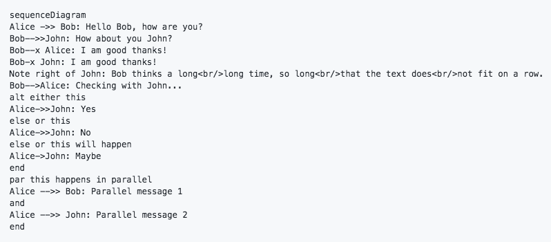
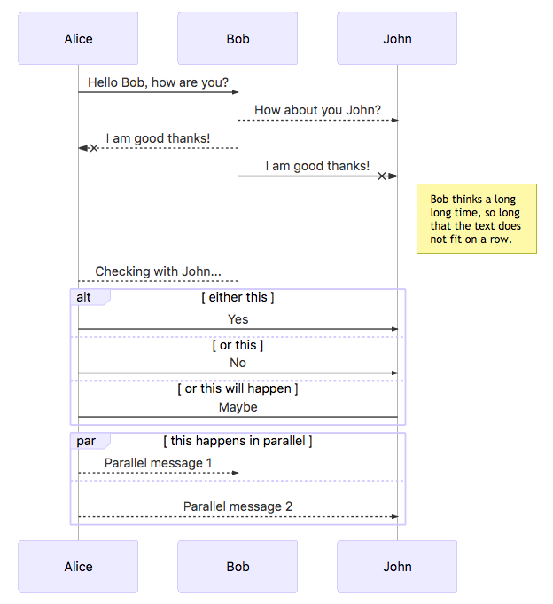
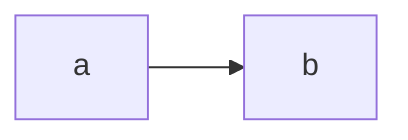

# mermaid-for-github-chrome-extention

> mermaid version: 8.0.0-rc.8
> MD5 (mermaid.js) = afd22ae60b87ad03fab277554f0f3d25

This is Chrome extention which apply [mermaid.js](https://github.com/knsv/mermaid) to GitHub and Gist.

| before | after |
| ---- | ---- |
|  |  |

## usage

Code blocks with language type `mermaid` are replaced to charts.

`````

`````

## installation

1. clone this repository to local
2. open chrome://extensions/
3. enable "Developer mode"
4. click "LOAD UNPACKED" and select "extention" directory of this repository